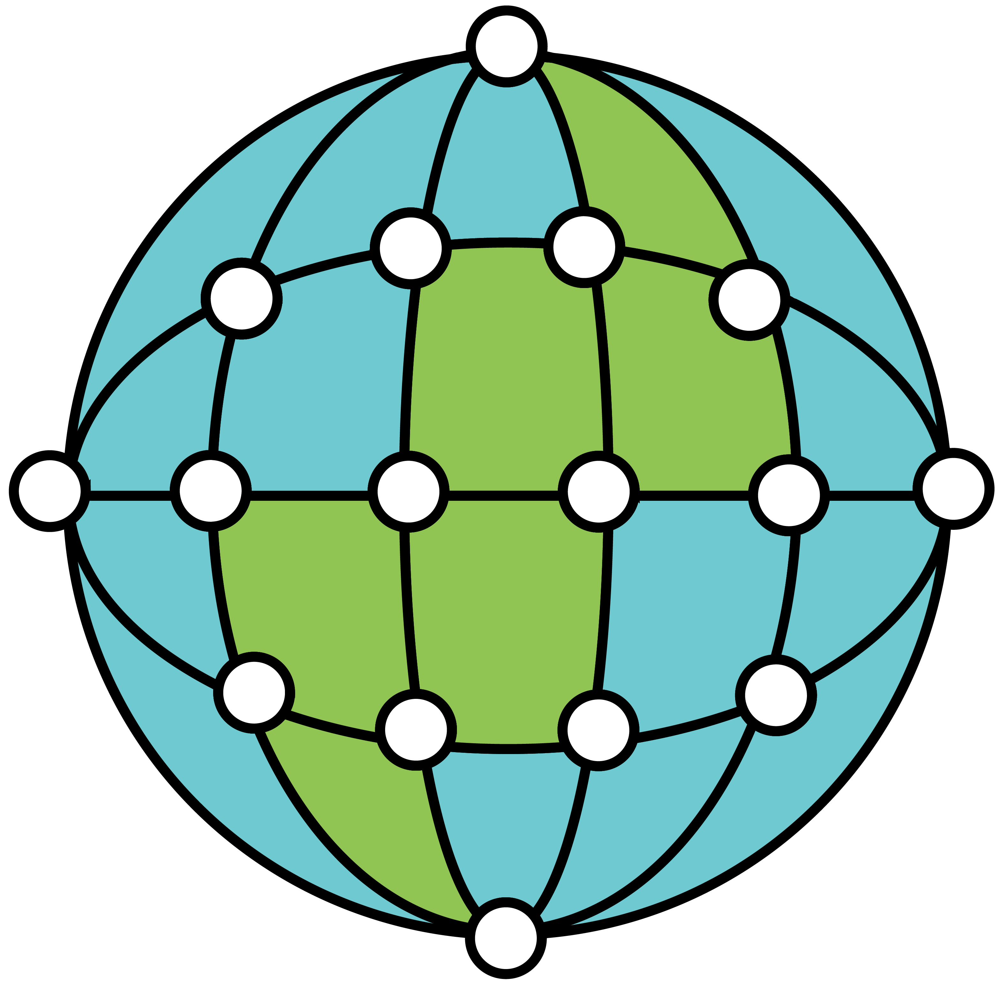

<p align="center">
  <br>
</p>
<p align="center">
  <a href="https://firstdonoharm.dev/version/3/0/cl-eco-mil.html">
    
  </a>
</p>

# GeoGrapher

*GeoGrapher* is a Python library for building remote sensing
computer vision datasets starting from vector features
(e.g. locations or georeferenced bounding boxes or segmentation maks).
It connects the features and images by a bipartite graph that keeps
track of the containment and intersection relations between them making
it suited for *object-centric* tasks. GeoGrapher also provides highly
general and customizable dataset cutting functionality as well as other
utility functions.

# Installation
This package has two external dependencies:
- Python 3.9 or newer.
- The geopandas and rasterio libraries might depend on GDAL base C libraries.
See [https://geopandas.org/en/stable/getting_started/install.html#dependencies](https://geopandas.org/en/stable/getting_started/install.html#dependencies)
and [https://pypi.org/project/rasterio/](https://pypi.org/project/rasterio/)
for instructions on installing these. On many Linux distros, you can use the
the `gdal-devel` or `libgdal-dev` packages.

The package itself (and its Python dependencies) can be installed with

```
pip install GeoGrapher
```

# Getting started
Read our our blogpost for an introduction to GeoGrapher, try out the tutorial
notebooks in the [notebooks directory](https://github.com/dida-do/GeoGrapher/tree/main/notebooks),
or read the documentation.

# Development
To create a local dev installation, clone the repo, `cd` into the repo folder,
and use the commands

```
python -m venv geographer-env
source geographer-env/bin/activate
make -B venv
```

to create a virtual environment, activate it, and create an editable local installation
of the package and its dependencies.

Use the `make format`, `make lint`, `make test`, and `make docs` commands to format,
lint, or test the code or to create the documentation locally.

To create the documentation locally, you will need to install
the pandoc external dependency following the instructions here
[https://pandoc.org/installing.html](https://pandoc.org/installing.html).

# Contributing to GeoGrapher
You can contribute by giving feedback, opening an issue, submitting
feature requests or bug reports, or submitting pull requests.

# Show your support
Give this project a star if you like it!

# Contact
Contact the maintainer at [@rustamdantia](https://github.com/rustamdantia).

# License
This project is licensed under a version of the Hippocratic License that in particular prohibits use for military activites. You can find a copy of the license [here](LICENSE).

[](https://firstdonoharm.dev/version/3/0/cl-eco-mil.html)
