# Class Diagram

Let's go!

```mermaid
classDiagram

    class Connector{

        +vectors
        +rasters

        +rasters_dir
        +labels_dir
        +download_dir
        +assoc_dir
        +raster_data_dirs

        +crs_epsg_code
        +segmentation_classes -> just classes
        +all_polygon_classes -> just all_classes

        +from_scratch(**kwargs)
        +from_data_dir(data_dir)
        +from_paths(paths)
        +save()

        +geoms_intersecting_raster(raster_id: raster_name) List~geom_id~
        +geoms_contained_in_raster(raster_id: raster_name) List~geom_id~
        +rasters_intersecting_geom(geom_id: geom_name) List~geom_id~
        +rasters_containing_geom(geom_id: geom_name) List~geom_id~

        +add_to_rasters_df(RastersDF: rasters_df)
        +add_to_geoms_df(GeomsDF: geoms_df)
        +drop_rasters(List~raster_id~: raster_names)
        +drop_geoms(List~geom_id~: geom_names)

        +make_labels(List~raster_id~: raster_names)
        +delete_labels(List~raster_id~: raster_names)

    }

    class Downloader{
    }

    class DownloaderForGeoms{
        +download(geom_names, **other_kwargs)
    }

    class DownloaderForAOI{
        +download(aoi, **other_kwargs)
    }

    Downloader --> Connector
    Downloader <|-- DownloaderForGeoms
    Downloader <|-- DownloaderForAOI

    class LabelMaker{
    }

    LabelMaker <|-- LabelMakerSegCategorical
    LabelMaker <|-- LabelMakerSegSoftCategorical
    LabelMaker <|-- LabelMakerObjectDetection
    LabelMaker <|-- LabelMakerClassification
    LabelMaker --> Connector

    class LabelMakerSegCategorical{
        +make(List~raster_id~: raster_names)
        +delete(List~raster_id~: raster_names)
    }
    class LabelMakerSegSoftCategorical{
        +make(List~raster_id~: raster_names)
        +delete(List~raster_id~: raster_names)
    }
    class LabelMakerObjectDetection{
        +make(List~raster_id~: raster_names)
        +delete(List~raster_id~: raster_names)
    }
    class LabelMakerClassification{
        +make(List~raster_id~: raster_names)
        +delete(List~raster_id~: raster_names)
    }

    class DSCreatorFromSource{
        <<interface>>
        +source_assoc
        +target_assoc
        +create()
        +update()
        +save()
    }
    DSCreatorFromSource --> "2" Connector
    DSCreatorFromSource <|-- DSCutterIterOverRasters
    DSCreatorFromSource <|-- DSCutterIterOverGeoms
    DSCutterIterOverRasters <|-- DSCutterEveryRasterToGrid
    DSCutterIterOverGeoms <|-- DSCutterRastersAroundGeoms

    class RasterFilterPredicate{
        -__call__(source_assoc, target_assoc, **kwargs)
    }

    DSCutterIterOverRasters *-- RasterFilterPredicate
    DSCutterIterOverRasters *-- SingleRasterCutter

    class SingleRasterCutter{
        -__call__(source_assoc, target_assoc, **kwargs)
    }
    class RasterSelector{
        -__call__(source_assoc, target_assoc, **kwargs)
    }
    class GeomFilterPredicate{
        -__call__(source_assoc, target_assoc, **kwargs)
    }

    DSCutterIterOverGeoms *-- SingleRasterCutter
    DSCutterIterOverGeoms *-- RasterSelector
    DSCutterIterOverGeoms *-- GeomFilterPredicate

    DSCreatorFromSource <|-- DSConvertGeoTiffToNpy
    DSCreatorFromSource <|-- DSConvertCombineRemoveClasses
    DSCreatorFromSource <|-- DSConverterSoftToCategorical


```

[![](https://mermaid.ink/raster/pako:eNq9V9tu4jAQ_ZUoT4GFl31EVaUVLVWl7na14TGS5caT1G1iI9uhQiz99h07oTiXFpC6RYIkM2fO3Dx22IapZBDOwrSgWl9xmitaJiIRAX6cLJhLISA1Um33cvv5tnYykoMsNWGZp-ElzaGWDUi58oQFfYCiK2TyRRSSso4YY5FpR-ZICaOGWoVuOUyVJrDSObEZenINeQnCUMOlIC5F0MH0MniqtAmaZ99tUZCVLDb5ANrq3iw8m0zJkuhUUZM-RuPx8wtVuR51Afuwo_1ND7Gi5lFH7tfXabqGaNTyWLeBCwNKY2O4yAkv8wi_hLNZYK-CljAK7rg2rxaN8tceQSqxMFwAQ6ozCRDRCcCCogY5C9zNCRRNCOcQ-N1ijBhJHBPLolu8Xi1c-PZ51Efu1290Y28sdi_xwUzJlSONnOu6Kq-Hsuge2LFErUC9FHS7eyV9BlLPwkkOoABzgkFtsmuP81UzXWDn-UP9QipXlO3AbEaHVCbBeCzNIyjSWucf0f64vx0kpZIfYzvwBFMcw7fNqae9-DudDiRzAg6ja8d-Zwv9E3vUK9lBU_McnmPI59RALhVPaXECOpaZOcPi_uEJ877CdZDajewYfG4T4RkyD6I7pRxOvp3StrN-T1-4R5C7d713SvTVEXRK_tXu2y38n95bcxvPFVBcFQs8kGJZqRQ81xcXbsfPaAqXl_4J5YDEHdme2OBEg-mJU-vBnWhvomrFuqL9qeeVaCA4t5ST8HsS9vaGAXA9_PG8MpjFLX7v13jFff5ME39rGWBrG12jdIPipbxRnA1bOcKOLyT6oWQlWOPNbxMqF7xA1G8FzC4Rv0tTQlL7qkIivy-TwG-H3Xff2XGHEhpjYH2fRwxiPNQLwMda386go_yE8FvViXHtNy-xn8drG_FVZa9XxGAZP4Z7yR-DDuTjhfPuKEiBLAaNlzzLlvLXanOqzVyWD_i6-QdKuYa5_-593BaPBDwPlrJ1aCYinIQlqJJyhv9qXDeSEN8nSkjCGd4yyGhVmCRMxA6h9T5zzTh6CmcZLTRMQloZGW9EGs6MqmAPav4cNajdP3vNalU)](https://mermaid.live/edit#pako:eNq9V9tu4jAQ_ZUoT4GFl31EVaUVLVWl7na14TGS5caT1G1iI9uhQiz99h07oTiXFpC6RYIkM2fO3Dx22IapZBDOwrSgWl9xmitaJiIRAX6cLJhLISA1Um33cvv5tnYykoMsNWGZp-ElzaGWDUi58oQFfYCiK2TyRRSSso4YY5FpR-ZICaOGWoVuOUyVJrDSObEZenINeQnCUMOlIC5F0MH0MniqtAmaZ99tUZCVLDb5ANrq3iw8m0zJkuhUUZM-RuPx8wtVuR51Afuwo_1ND7Gi5lFH7tfXabqGaNTyWLeBCwNKY2O4yAkv8wi_hLNZYK-CljAK7rg2rxaN8tceQSqxMFwAQ6ozCRDRCcCCogY5C9zNCRRNCOcQ-N1ijBhJHBPLolu8Xi1c-PZ51Efu1290Y28sdi_xwUzJlSONnOu6Kq-Hsuge2LFErUC9FHS7eyV9BlLPwkkOoABzgkFtsmuP81UzXWDn-UP9QipXlO3AbEaHVCbBeCzNIyjSWucf0f64vx0kpZIfYzvwBFMcw7fNqae9-DudDiRzAg6ja8d-Zwv9E3vUK9lBU_McnmPI59RALhVPaXECOpaZOcPi_uEJ877CdZDajewYfG4T4RkyD6I7pRxOvp3StrN-T1-4R5C7d713SvTVEXRK_tXu2y38n95bcxvPFVBcFQs8kGJZqRQ81xcXbsfPaAqXl_4J5YDEHdme2OBEg-mJU-vBnWhvomrFuqL9qeeVaCA4t5ST8HsS9vaGAXA9_PG8MpjFLX7v13jFff5ME39rGWBrG12jdIPipbxRnA1bOcKOLyT6oWQlWOPNbxMqF7xA1G8FzC4Rv0tTQlL7qkIivy-TwG-H3Xff2XGHEhpjYH2fRwxiPNQLwMda386go_yE8FvViXHtNy-xn8drG_FVZa9XxGAZP4Z7yR-DDuTjhfPuKEiBLAaNlzzLlvLXanOqzVyWD_i6-QdKuYa5_-593BaPBDwPlrJ1aCYinIQlqJJyhv9qXDeSEN8nSkjCGd4yyGhVmCRMxA6h9T5zzTh6CmcZLTRMQloZGW9EGs6MqmAPav4cNajdP3vNalU)

